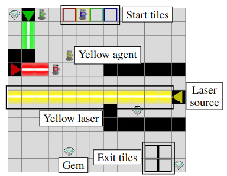

# Procedural Generation of Solvable Levels in LLE

### Master Thesis – Hugo Charels (ULB, 2025–2026)

This repository contains the code and experiments for my Master Thesis:

> **Procedural Generation of Solvable Levels in a Multi-Agent Reinforcement Learning Environment using Curriculum Learning**

The project focuses on generating **solvable, cooperative, and learnable levels** for the **Laser Learning Environment (LLE)**, a benchmark designed for studying coordination in Multi-Agent Reinforcement Learning (MARL).

---

## Project Overview

The goal of this work is to design and evaluate a framework capable of generating levels that satisfy three core properties:

- **Solvability** – Every generated level must admit at least one valid joint solution.
- **Cooperation** – Levels must require inter-agent coordination.
- **Learnability** – Generated levels should be suitable for training MARL agents, potentially through curriculum learning.

Rather than manually designing levels, this project explores **procedural generation techniques** combined with theoretical guarantees and validation mechanisms.

---

## Laser Learning Environment (LLE)

<p align="center">
  
</p>

The Laser Learning Environment (LLE) is a 2D grid-based cooperative puzzle game where:

- Agents must navigate through walls and colored laser beams.
- Each laser can only be blocked by an agent of the matching color.
- All agents must reach their exits **simultaneously**.
- Intermediate cooperative steps provide **no reward**, making exploration difficult.

This environment is particularly suited for studying:

- Coordination under sparse rewards
- State-space bottlenecks
- Temporal synchronization
- Inter-agent dependencies

Official LLE implementation: https://github.com/yamoling/lle

---

## Getting Started

### Install

```bash
pip install -e .
```

### Generate levels

```bash
cd src

# Random solvable level
python generate.py random_solvable --size 5 5 --agents 2

# Random cooperative level (requires cooperation)
python generate.py random_cooperative --size 6 6 --agents 2 --lasers 1

# Constrained cooperative (geometric + cooperation filters)
python generate.py constrained_random_cooperative --size 5 5 --agents 2

# Save to file and display
python generate.py random_solvable --size 5 5 --agents 2 --save output/ --display
```

### Run tests

```bash
pytest src/tests/
```

---

## What This Repository Contains

### 1. SAT-Based Solver

- CNF encoding of LLE levels over timesteps T=0..T_MAX
- `WorldSolver`: checks solvability via Minisat
- `WorldSolverStrictLaser`: variant where agents cannot block their own-color lasers
- `CooperationSolver`: detects cooperation requirement (solvable normally but not with strict lasers)
- `WorldData` Protocol: clean boundary between solver and LLE

### 2. Level Generation Framework

- Modular generator architecture (`BaseGenerator` + `@register_generator`)
- `RandomSolvableGenerator`: random sampling with SAT filter
- `ConstrainedRandomSolvableGenerator`: adds geometric constraints (beam length, exit placement)
- `RandomCooperativeGenerator`: adds cooperation filter
- `ConstrainedRandomCooperativeGenerator`: combines both filters
- `WorldBuilder`: programmatic level construction

### 3. Benchmarking Tools

- Solver benchmarks across LLE default levels
- Timing and clause count breakdown by constraint type
- Plot generation for analysis

---

## Project Structure

```
src/
  solver/       SAT solver, constraints, cooperation detection
  generators/   Level generators (random, constrained, cooperative)
  benchmark/    Benchmarking runner and plots
  scripts/      Demo and utility scripts
  tests/        pytest test suite
  cli.py        CLI argument parser
  generate.py   CLI entry point
  levels.py     LLE default levels registry
```

---

## Research Questions

This project investigates:

- How to embed **solvability directly into generation**
- How to enforce **structural cooperation**
- How level structure impacts **MARL learnability**
- How to balance **diversity vs. controllability**
- How to integrate **curriculum learning into PCG**

---

## License

This project is developed for academic research purposes.
License details will be added upon completion.
